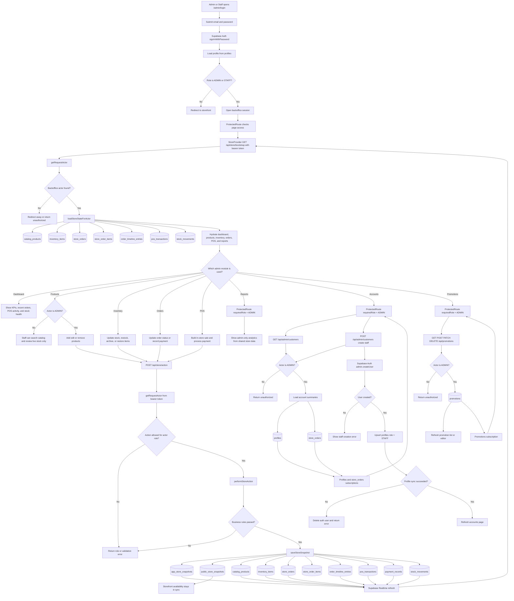

# Admin Diagram

```mermaid
flowchart TD
    A[Admin or Staff opens /admin/login] --> B[Submit email and password]
    B --> C[Supabase Auth signInWithPassword]
    C --> D[Load profile from profiles]
    D --> E{Role is ADMIN or STAFF?}
    E -- No --> F[Redirect to storefront]
    E -- Yes --> G[Open backoffice session]

    G --> H[ProtectedRoute checks page access]
    H --> I[StoreProvider GET /api/store/bootstrap with bearer token]
    I --> J[getRequestActor]
    J --> K{Backoffice actor found?}
    K -- No --> L[Redirect away or return unauthorized]
    K -- Yes --> M[loadStoreStateForActor]

    M --> N[(catalog_products)]
    M --> O[(inventory_items)]
    M --> P[(store_orders)]
    M --> Q[(store_order_items)]
    M --> R[(order_timeline_entries)]
    M --> S[(pos_transactions)]
    M --> T[(stock_movements)]
    M --> U[Hydrate dashboard, products, inventory, orders, POS, and reports]

    U --> V{Which admin module is used?}

    V -- Dashboard --> W[Show KPIs, recent orders, POS activity, and stock health]
    V -- Products --> X{Actor is ADMIN?}
    X -- No --> Y[Staff can search catalog and review live stock only]
    X -- Yes --> Z[Add edit or remove products]
    V -- Inventory --> AA[Update stock, restock, archive, or restore items]
    V -- Orders --> AB[Update order status or record payment]
    V -- POS --> AC[Build in-store sale and process payment]
    V -- Reports --> AD[ProtectedRoute requiredRole = ADMIN]
    AD --> AE[Show admin-only analytics from shared store data]
    V -- Accounts --> AF[ProtectedRoute requiredRole = ADMIN]
    V -- Promotions --> AG[ProtectedRoute requiredRole = ADMIN]

    Z --> AH[POST /api/store/action]
    AA --> AH
    AB --> AH
    AC --> AH
    AH --> AI[getRequestActor from bearer token]
    AI --> AJ{Action allowed for actor role?}
    AJ -- No --> AK[Return role or validation error]
    AJ -- Yes --> AL[performStoreAction]
    AL --> AM{Business rules passed?}
    AM -- No --> AK
    AM -- Yes --> AN[saveStoreSnapshot]

    AN --> AO[(app_store_snapshots)]
    AN --> AP[(public_store_snapshots)]
    AN --> AQ[(catalog_products)]
    AN --> AR[(inventory_items)]
    AN --> AS[(store_orders)]
    AN --> AT[(store_order_items)]
    AN --> AU[(order_timeline_entries)]
    AN --> AV[(pos_transactions)]
    AN --> AW[(payment_records)]
    AN --> AX[(stock_movements)]
    AP --> AY[Storefront availability stays in sync]

    AF --> AZ[GET /api/admin/customers]
    AZ --> BA{Actor is ADMIN?}
    BA -- No --> BB[Return unauthorized]
    BA -- Yes --> BC[Load account summaries]
    BC --> BD[(profiles)]
    BC --> BE[(store_orders)]

    AF --> BF[POST /api/admin/customers create staff]
    BF --> BA
    BF --> BG[Supabase Auth admin.createUser]
    BG --> BH{User created?}
    BH -- No --> BI[Show staff creation error]
    BH -- Yes --> BJ[Upsert profiles role = STAFF]
    BJ --> BK{Profile sync succeeded?}
    BK -- No --> BL[Delete auth user and return error]
    BK -- Yes --> BM[Refresh accounts page]

    AG --> BN[GET POST PATCH DELETE /api/promotions]
    BN --> BO{Actor is ADMIN?}
    BO -- No --> BP[Return unauthorized]
    BO -- Yes --> BQ[(promotions)]
    BQ --> BR[Refresh promotion list or editor]

    AO --> BS[Supabase Realtime refresh]
    AQ --> BS
    AR --> BS
    AS --> BS
    AU --> BS
    AV --> BS
    AW --> BS
    AX --> BS
    BS --> I

    BD --> BT[Profiles and store_orders subscriptions]
    BE --> BT
    BT --> AF

    BQ --> BU[Promotions subscription]
    BU --> AG
```
