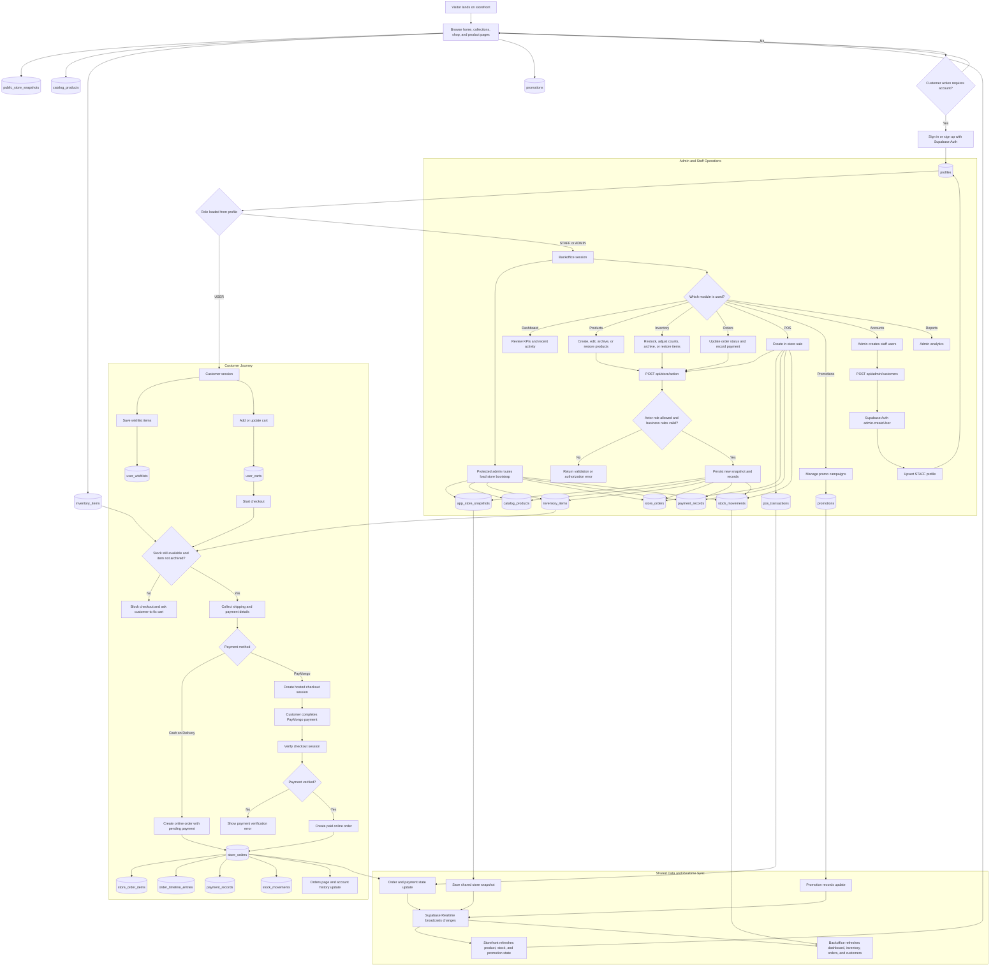

# System Overview Diagram

```mermaid
flowchart TD
    A[Visitor lands on storefront] --> B[Browse home, collections, shop, and product pages]
    B --> C[(public_store_snapshots)]
    B --> D[(catalog_products)]
    B --> E[(inventory_items)]
    B --> F[(promotions)]

    B --> G{Customer action requires account?}
    G -- No --> B
    G -- Yes --> H[Sign in or sign up with Supabase Auth]
    H --> I[(profiles)]
    I --> J{Role loaded from profile}

    J -- USER --> K[Customer session]
    J -- STAFF or ADMIN --> L[Backoffice session]

    subgraph Customer["Customer Journey"]
        direction TD
        K --> M[Save wishlist items]
        M --> N[(user_wishlists)]

        K --> O[Add or update cart]
        O --> P[(user_carts)]

        P --> Q[Start checkout]
        Q --> R{Stock still available and item not archived?}
        R -- No --> S[Block checkout and ask customer to fix cart]
        R -- Yes --> T[Collect shipping and payment details]
        T --> U{Payment method}
        U -- Cash on Delivery --> V[Create online order with pending payment]
        U -- PayMongo --> W[Create hosted checkout session]
        W --> X[Customer completes PayMongo payment]
        X --> Y[Verify checkout session]
        Y --> Z{Payment verified?}
        Z -- No --> ZA[Show payment verification error]
        Z -- Yes --> ZB[Create paid online order]

        V --> ZC[(store_orders)]
        ZB --> ZC
        ZC --> ZD[(store_order_items)]
        ZC --> ZE[(order_timeline_entries)]
        ZC --> ZF[(payment_records)]
        ZC --> ZG[(stock_movements)]
        ZC --> ZH[Orders page and account history update]
    end

    subgraph Backoffice["Admin and Staff Operations"]
        direction TD
        L --> AA[Protected admin routes load store bootstrap]
        AA --> AB[(app_store_snapshots)]
        AA --> AC[(catalog_products)]
        AA --> AD[(inventory_items)]
        AA --> AE[(store_orders)]
        AA --> AF[(payment_records)]
        AA --> AG[(stock_movements)]

        L --> AH{Which module is used?}
        AH -- Dashboard --> AI[Review KPIs and recent activity]
        AH -- Products --> AJ[Create, edit, archive, or restore products]
        AH -- Inventory --> AK[Restock, adjust counts, archive, or restore items]
        AH -- Orders --> AL[Update order status and record payment]
        AH -- POS --> AM[Create in-store sale]
        AH -- Promotions --> AN[Manage promo campaigns]
        AH -- Accounts --> AO[Admin creates staff users]
        AH -- Reports --> AP[Admin analytics]

        AJ --> AQ[POST api/store/action]
        AK --> AQ
        AL --> AQ
        AM --> AQ
        AQ --> AR{Actor role allowed and business rules valid?}
        AR -- No --> AS[Return validation or authorization error]
        AR -- Yes --> AT[Persist new snapshot and records]

        AT --> AB
        AT --> AC
        AT --> AD
        AT --> AE
        AT --> AF
        AT --> AG
        AN --> AU[(promotions)]

        AO --> AV[POST api/admin/customers]
        AV --> AW[Supabase Auth admin.createUser]
        AW --> AX[Upsert STAFF profile]
        AX --> I

        AM --> AY[(pos_transactions)]
        AM --> AE
        AM --> AF
        AM --> AG
    end

    subgraph Sync["Shared Data and Realtime Sync"]
        direction TD
        AB --> BA[Save shared store snapshot]
        AU --> BB[Promotion records update]
        ZC --> BC[Order and payment state update]
        AY --> BC

        BA --> BD[Supabase Realtime broadcasts changes]
        BB --> BD
        BC --> BD
        BD --> BE[Storefront refreshes product, stock, and promotion state]
        BD --> BF[Backoffice refreshes dashboard, inventory, orders, and customers]
    end

    E --> R
    AD --> R
    AG --> BF
    BE --> B
```
